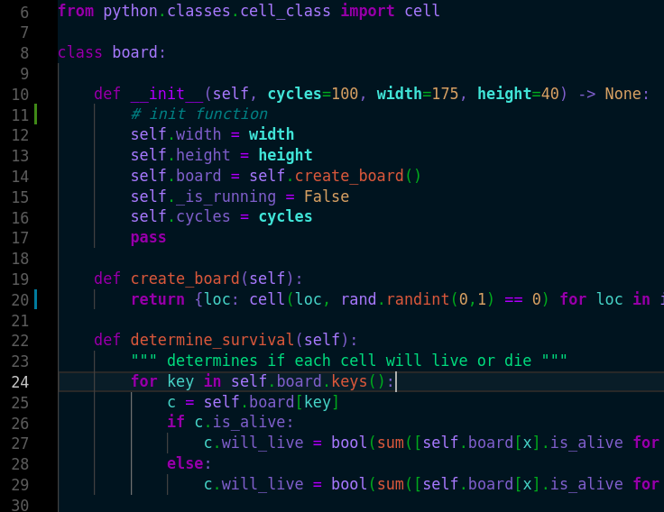

# Bladerunner Theme for VS-Code
## Description

This theme has that 80s sci-fi dystopian neon vibe and is inspired by the imagery in Bladerunner of Los Angeles in the year 2019.

## Installation

clone the repository someplace you like, then copy it into your .vscode/extensions/ folder

## Current tunes

### Python3

The current tune works well for python3 and has the following features:

* Minimal italics, except for in-line comments
* parameter names in function calls are bold
* member variables have a different color than member functions
* keyword flow (for, if, else, in, etc.) are bold

## To Do

My to do list for tunes of this theme

* C++
* Bash

If you like this theme, but want a tune for a specific language let me know and I'll add it to the to do list.

**Enjoy!**
